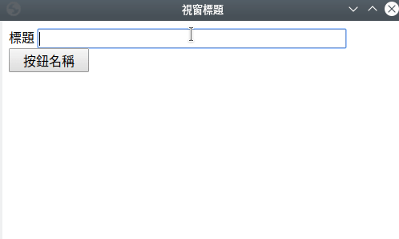
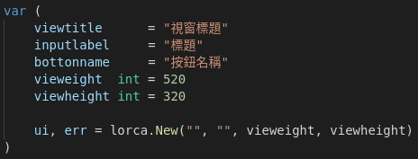
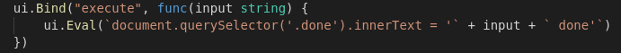

# GolangUI

## Features
- 對[github.com/zserge/lorca](https://github.com/zserge/lorca)進行修改
- 目標：快速開發一個圖形介面
- 並不是要做package而是做一個模版,之後要簡單做圖形介面只需要複製後修改即可

## How to use
> 請直接複製,接著按照下面的步驟修改

### 基本設定
- Inputtitle表整個視窗的標題
- Inputlabel表在輸入格旁的標題
- Inputbotton表按鈕的名稱
- Makeview為視窗的大小

### 程式執行

> 按下按鈕後會做的動作都寫在這裡

- input 是輸入的數值  
- `document.querySelector('.done').innerText =` 則會輸出到按鈕下面

# Vision

## 1.0.0 (2019-11-14)

最初版本釋出

